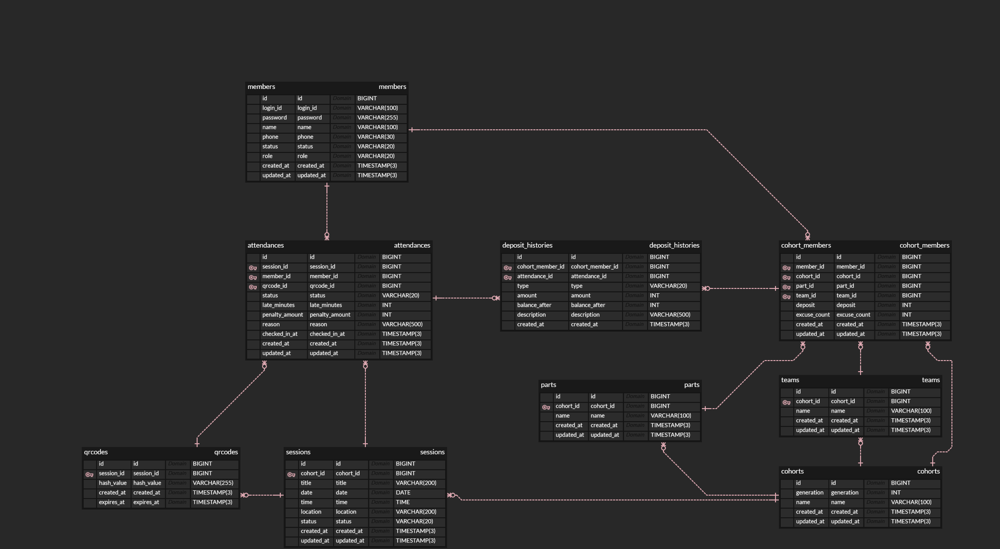

# prography-11th-backend

안녕하세요, 프로그라피 11기 지원자 유어진입니다.

- [1. 기술스택](#1-기술-스택)
- [2. 실행 방법](#2-실행-방법)
- [3. 기본 설정](#3-기본-설정)
- [4. 시드 데이터](#4-시드-데이터)
- [5. API 구현범위](#5-api-구현-범위)
- [6. 공통 응답 포맷](#6-공통-응답-포맷)
- [7. 산출물](#7-산출물)

## 1. 기술 스택
- Java 17
- Spring Boot
- Spring Web / Spring Data JPA / Validation
- H2 Database (in-memory)
- BCrypt (`spring-security-crypto`)

## 2. 실행 방법
### 2.1 요구 사항
- JDK 17 이상

### 2.2 애플리케이션 실행
```bash
cd backend
./gradlew bootRun
```

Windows:
```powershell
cd backend
.\gradlew.bat bootRun
```

### 2.3 테스트 실행
```bash
cd backend
./gradlew test
```

Windows:
```powershell
cd backend
.\gradlew.bat test
```

## 3. 기본 설정
- Base URL: http://localhost:8080/api/v1
- Swagger UI : http://localhost:8080/swagger-ui/index.html
- H2 Console: http://localhost:8080/h2-console
- DB URL: jdbc:h2:mem:prography
- Username: `sa`
- Password: (empty)

## 4. 시드 데이터
서버 시작 시 자동 로드됩니다.

- Cohort: 10기, 11기
- Part: 기수별 `SERVER`, `WEB`, `iOS`, `ANDROID`, `DESIGN`
- Team: 11기 `Team A`, `Team B`, `Team C`
- Admin 계정:
  - loginId: `admin`
  - password: `admin1234`
  - role: `ADMIN`
  - 초기 보증금: `100,000`

## 5. API 구현 범위
### 5.1 필수 API (16)
1. `POST /auth/login`
2. `GET /members/{id}`
3. `POST /admin/members`
4. `GET /admin/members`
5. `GET /admin/members/{id}`
6. `PUT /admin/members/{id}`
7. `DELETE /admin/members/{id}`
8. `GET /admin/cohorts`
9. `GET /admin/cohorts/{cohortId}`
10. `GET /sessions`
11. `GET /admin/sessions`
12. `POST /admin/sessions`
13. `PUT /admin/sessions/{id}`
14. `DELETE /admin/sessions/{id}`
15. `POST /admin/sessions/{sessionId}/qrcodes`
16. `PUT /admin/qrcodes/{qrCodeId}`

### 5.2 가점 API (9)
17. `POST /attendances`
18. `GET /attendances`
19. `GET /members/{memberId}/attendance-summary`
20. `POST /admin/attendances`
21. `PUT /admin/attendances/{id}`
22. `GET /admin/attendances/sessions/{sessionId}/summary`
23. `GET /admin/attendances/members/{memberId}`
24. `GET /admin/attendances/sessions/{sessionId}`
25. `GET /admin/cohort-members/{cohortMemberId}/deposits`

## 6. 공통 응답 포맷

- 성공: [ApiResponse.java](src\main\java\app\backend\global\api\ApiResponse.java)
- 실패: [ApiException.java](src\main\java\app\backend\global\error\ApiException.java)


## 7. 산출물

### ERD


[view more](docs/ERD.md)

### System Design Architecture


과제 요구사항 중 `이상적인 아키텍처`라는 언급이 가장 저에게 어려움을 줬습니다.

과연 `이상적 아키텍처`라는 것이 존재할까? 라는 근본적인 의문점을 가졌기 때문입니다.

아직 아키텍처에 대한 이해도는 높지 않았기에 **협력**을 기준으로 이와 같은 구조를 설계 했습니다.

자세한 내용은 [해당 문서](/docs/SYSTEM_ARCHITECTURE.md)를 참고해주시면 감사하겠습니다.

### 기타 문서

- AI 사용 내역: [docs/AI_USAGE.md](docs/AI_USAGE.md)

- 스펙 정합성 점검 기록: [docs/spec-alignment-issues.md](docs/spec-alignment-issues.md)

- 고민했던 점: [docs/RETROSPECTIVE.md](docs/RETROSPECTIVE.md)
