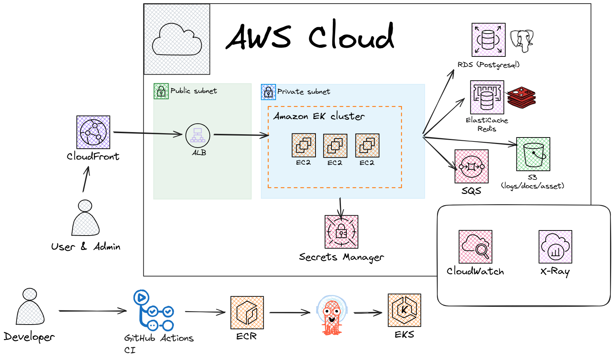

# System Design Architecture

## 컴퓨팅 계층
- Runtime: Spring Boot (Java 17+)
- 배포 단위: Docker Container
- 오케스트레이션: Amazon EKS
- 오토스케일링:
  - HPA(요청량/CPU/메모리 기반)
  - Cluster Autoscaler
- 무중단 배포:
  - Rolling Update 또는 Blue/Green(Argo Rollouts)

## 데이터 계층
### Primary DB
- Amazon RDS PostgreSQL (Multi-AZ)
- 주요 이유:
  - 트랜잭션 정합성(출석 수정 시 보증금 diff 반영)
  - 관계형 모델 적합(Member/Cohort/Attendance/DepositHistory)

### 캐시
- Redis(ElastiCache)
- 사용 예:
  - 빈번한 조회 데이터(기수/파트/팀)
  - QR 활성 상태 단기 캐싱
  - Rate limiting 보조 키

### 비동기 큐
- SQS
- 사용 예:
  - 출석 이벤트 후처리(통계 집계, 알림, 감사 로그)
  - 외부 연동 실패 재시도

## 도메인 서비스 분리(중장기)
초기에는 모놀리식으로 시작하되, 확장 시 아래 기준으로 분리 가능:
- Member Service
- Session/QRCode Service
- Attendance Service
- Deposit Service

분리 기준:
- 트래픽 패턴이 다름
- 변경 주기가 다름
- 장애 격리 필요

## 보안 아키텍처
- Edge 보안:
  - AWS WAF + CloudFront
  - IP/봇/비정상 패턴 차단
- 애플리케이션 보안:
  - BCrypt 비밀번호 해시
  - DTO Validation + 전역 예외 처리
  - 표준 에러코드 반환
- 비밀 관리:
  - DB 비밀번호/키는 Secrets Manager 관리
  - 코드/리포지토리에 비밀값 미저장
- 네트워크:
  - Private Subnet에 RDS/Redis 배치
  - Security Group 최소 권한

## 데이터 정합성 전략
- 트랜잭션 경계:
  - 출석 등록/수정 + 보증금 변경 + 이력 저장을 단일 트랜잭션 처리
- 제약 조건:
  - `(session_id, member_id)` unique
  - `login_id` unique
- 멱등성/중복 방지:
  - 출석 중복 체크
  - QR 만료/활성 1개 정책
- 감사 가능성:
  - DepositHistory, Attendance 변경 이력 유지

## 관측성(Observability)
- Metrics:
  - API latency, error rate, DB connection pool, queue backlog
- Logs:
  - 구조화 JSON 로그
  - traceId/requestId 포함
- Tracing:
  - OpenTelemetry + X-Ray/Jaeger
- Alert:
  - 5xx 비율 급증, DB 지연, 큐 적체 임계치 기반 알람

권장 게이트:
- 테스트 실패 시 배포 차단
- 취약점 임계치 초과 시 배포 차단
- 운영 배포 전 스테이징 스모크 테스트
